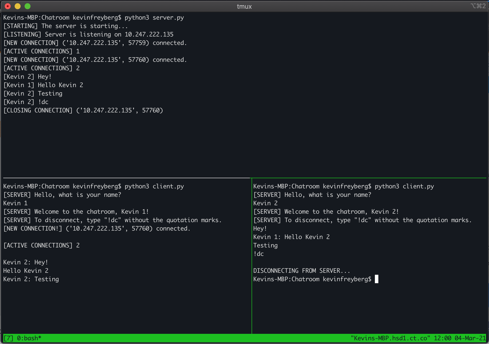

# Python-Chatroom

This is a WIP chatroom written in Python. At a minimum, it functionally works as a chatroom. New features coming soon.

Usage:
This chatroom works across multiple devices on a local network. Just run server.py on one device, find the IP of said device,
and modify client.py to accommodate for the server IP. (In client.py, edit the SERVER variable to hold a string containing the IP.)

If you want to test on only one device, you could open different terminals that would each separately run the server.py (ONLY 1 should
run server.py) and client.py

Here is a screenshot to demonstrate:
 

More features to come.
